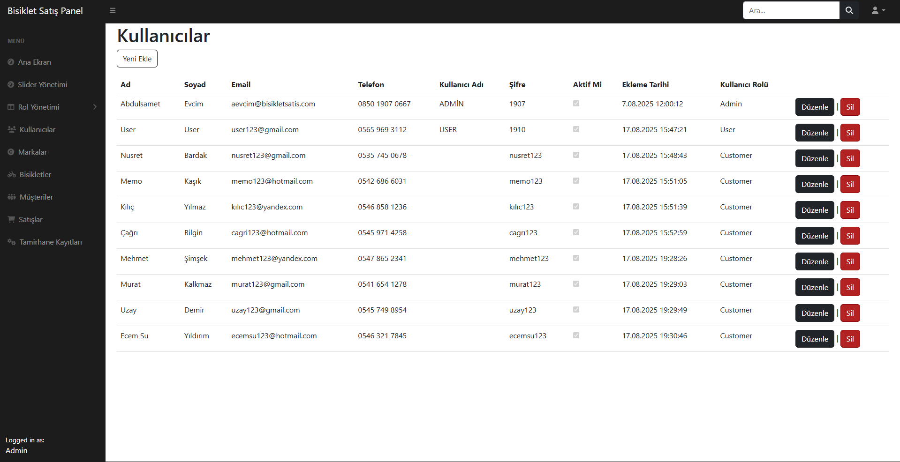

# Bisiklet Tanıtım ve Satış Destek Uygulaması 🚴‍♂️

Bu proje, bisiklet ürünlerinin çevrimiçi incelenmesini ve bilgilerini alabilmesi amacıyla
ASP.NET Core MVC kullanılarak geliştirilmiştir.

---

## ✨ Özellikler
- 👤 **Kullanıcı kayıt & giriş**
- 🚴 **Bisiklet listeleme ve detay sayfası**
- ❤️ **Favorilere ekleme / çıkarma**
- 🖼️ **Ana sayfa slider alanı**

- 🛠️ **Admin paneli**:
  - 📦 *Bisiklet / Marka / Müşteri CRUD*
  - 👥 *Kullanıcı & Rol yönetimi*
  - 💰 *Satış (Satis) kayıtları*
  - 🔧 *Tamirhane / Servis kayıtları (onarım süreçleri)*

---

## 🛠️ Kullanılan Teknolojiler
- **ASP.NET Core MVC** – web uygulama geliştirme
- **Entity Framework Core** – ORM ve veritabanı işlemleri
- **Identity** – kullanıcı/rol yönetimi
- **Bootstrap 5** – arayüz tasarımı
- **Font Awesome** – ikon kütüphanesi
- **Visual Studio 2022** – geliştirme ortamı
- **Git & GitHub** – versiyon kontrol ve proje yönetimi

---

## 📸 Ekran Görüntüleri

### 🌐 Kullanıcı Arayüzü

#### Ana Sayfa
  
*Ana sayfa görünümü*

#### Giriş
  
*Kullanıcı giriş ekranı*

#### Kaydol
  
*Yeni kullanıcı kayıt ekranı*

#### Hesabım
  
*Kullanıcının profil sayfası*

#### Tüm Bisikletler

#### Favoriler ve İncele

#### Detay

#### Favoriler

---

### 🛠️ Admin Paneli

#### Dashboard

#### Slider Yönetimi

#### Kullanıcılar

#### Markalar

#### Bisikletler

#### Müşteriler

#### Satışlar

#### Tamirhane

