# Bisiklet Tanıtım ve Satış Destek Uygulaması 🚴‍♂️

Bu proje, bisiklet ürünlerinin çevrimiçi incelenmesini ve bilgilerini alabilmesi amacıyla
ASP.NET Core MVC kullanılarak geliştirilmiştir.

## Özellikler
- Kullanıcı kayıt & giriş
- Bisiklet listeleme ve detay sayfası
- Favorilere ekleme / çıkarma
- Ana sayfa slider alanı
- Admin paneli:
  - Bisiklet / Marka / Müşteri CRUD
  - Kullanıcı & Rol yönetimi
  - Satış (Satis) kayıtları
  - Tamirhane/Servis kayıtları (onarım süreçleri)

## Ekran Görüntüleri

#### Ana Sayfa
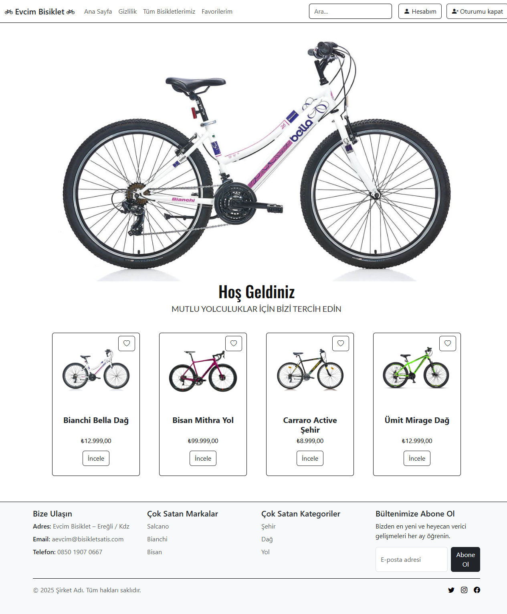

#### Giriş

#### Kaydol
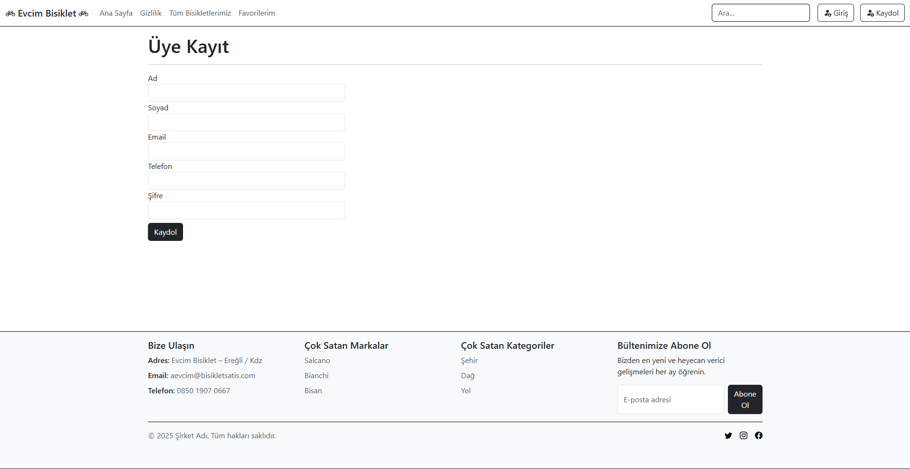

#### Hesabım
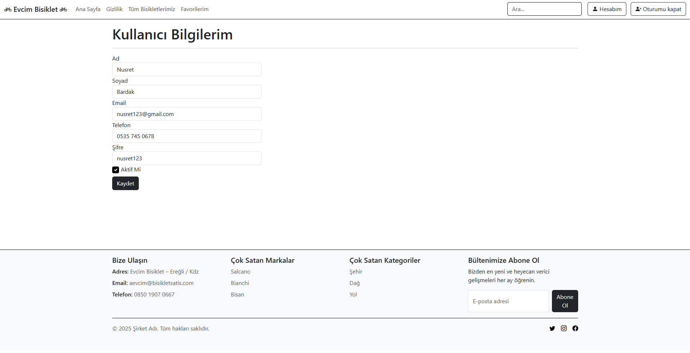

#### Tüm Bisikletler
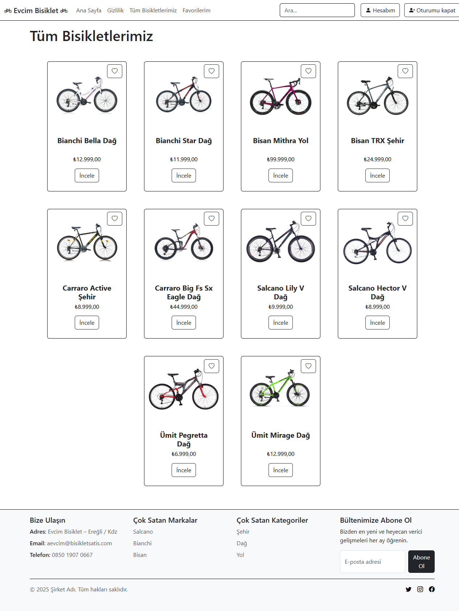

#### Favoriler ve İncele
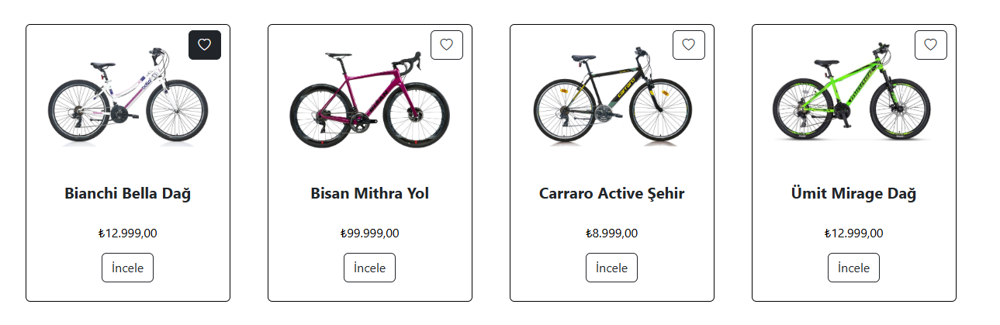

#### Detay
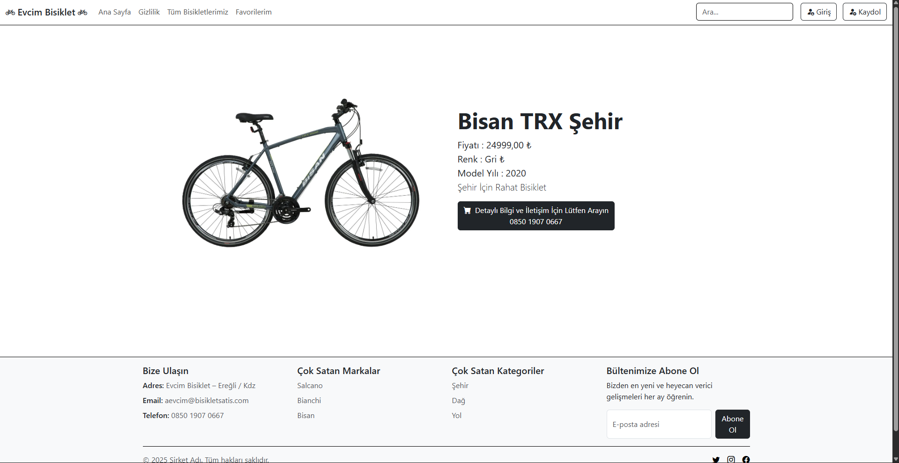

#### Favoriler
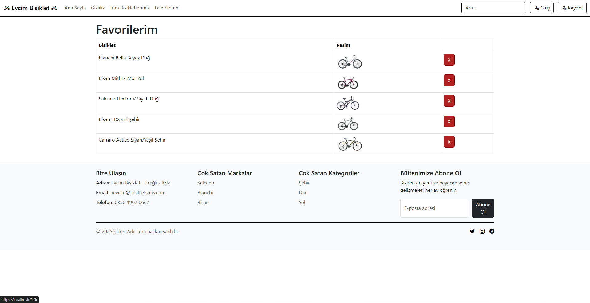

### Admin Paneli

#### Dashboard
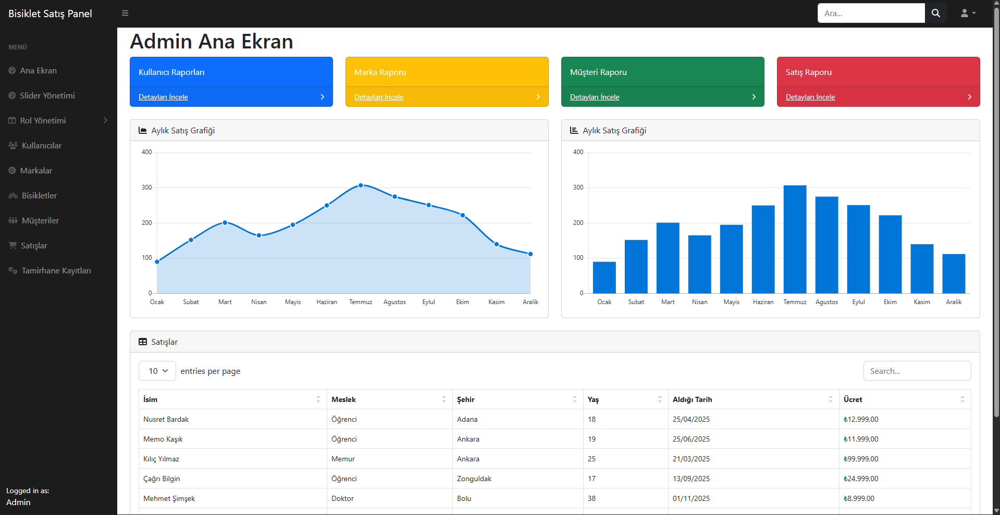

#### Slider
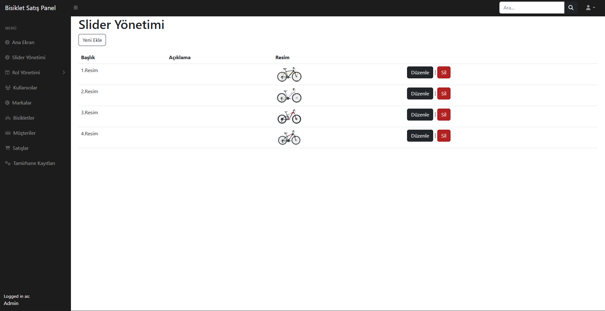

#### Kullanıcılar

#### Markalar
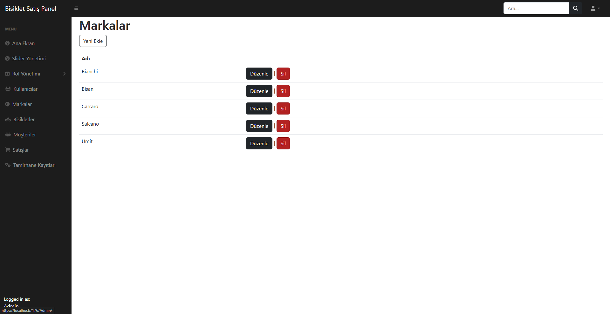

#### Bisikletler
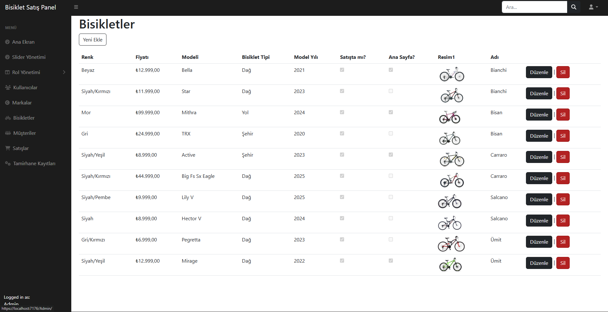

#### Müşteriler
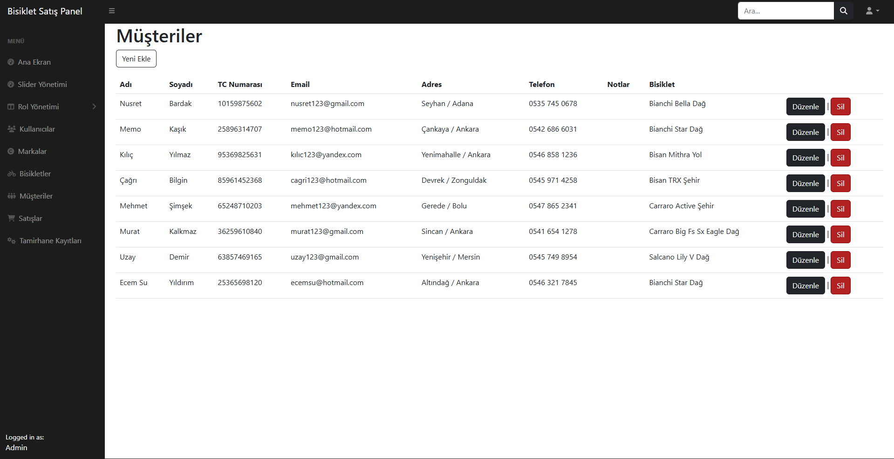

#### Satışlar
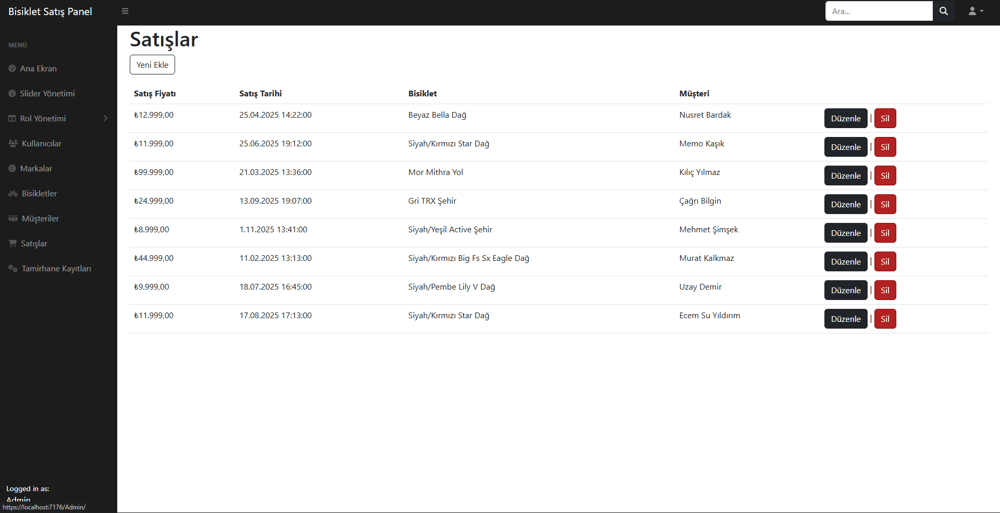

#### Tamirhane
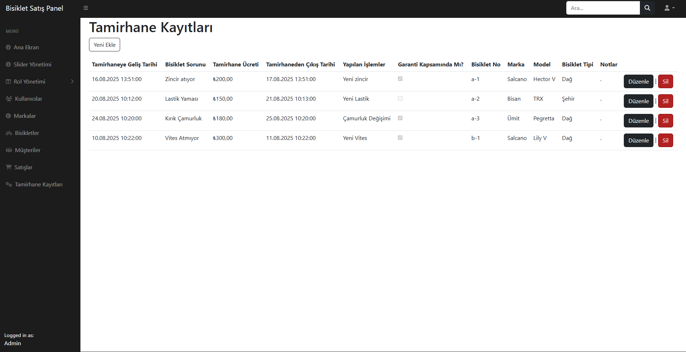
