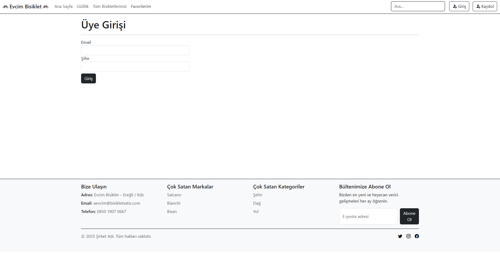

# Bisiklet Tanıtım ve Satış Destek Uygulaması 🚴‍♂️

Bu proje, bisiklet ürünlerinin çevrimiçi incelenmesini ve bilgilerini alabilmesi amacıyla
ASP.NET Core MVC kullanılarak geliştirilmiştir.

## Özellikler
- Kullanıcı kayıt & giriş
- Bisiklet listeleme ve detay sayfası
- Favorilere ekleme / çıkarma
- Ana sayfa slider alanı
- Admin paneli:
  - Bisiklet / Marka / Müşteri CRUD
  - Kullanıcı & Rol yönetimi
  - Satış (Satis) kayıtları
  - Tamirhane/Servis kayıtları (onarım süreçleri)

## Ekran Görüntüleri
### Ana Sayfa

#### Ana Sayfa

#### Giriş

#### Kaydol

#### Hesabım

#### Tüm Bisikletler

#### Favoriler ve İncele

#### Detay

#### Favoriler

### Ürün Detay

